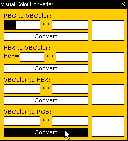



## \[Aurora Borealis\] Visual Color Converter

### Description

Converts any color to any format... Thanks to Dan Redding - Blue Knot Software for making the VBColor to RGB code. Please notice me if something is not working. I made this program becouse I was trying to make better GUI's, but none of the default VB Colors was good enough for me. So I used Photoshop to find the color I wanted and then needed something to convert it to VBColor. And since it was pretty simple to make, I made some other convertions as well. As I said earlier, the last one by Dan Redding - Blue Knot Software, was really good. Thanks.
 
### More Info
 

             |
---                |---
**Submitted On**   |2002-10-16 22:10:58
**By**             |[Arcanix](https://github.com/Planet-Source-Code/PSCIndex/blob/master/ByAuthor/arcanix.md)
**Level**          |Beginner
**User Rating**    |4.4 (22 globes from 5 users)
**Compatibility**  |VB 5\.0, VB 6\.0
**Category**       |[Complete Applications](https://github.com/Planet-Source-Code/PSCIndex/blob/master/ByCategory/complete-applications__1-27.md)
**World**          |[Visual Basic](https://github.com/Planet-Source-Code/PSCIndex/blob/master/ByWorld/visual-basic.md)
**Archive File**   |[Oblivion\_\_14709010162002\.zip](https://github.com/Planet-Source-Code/arcanix-aurora-borealis-visual-color-converter__1-39885/archive/master.zip)

